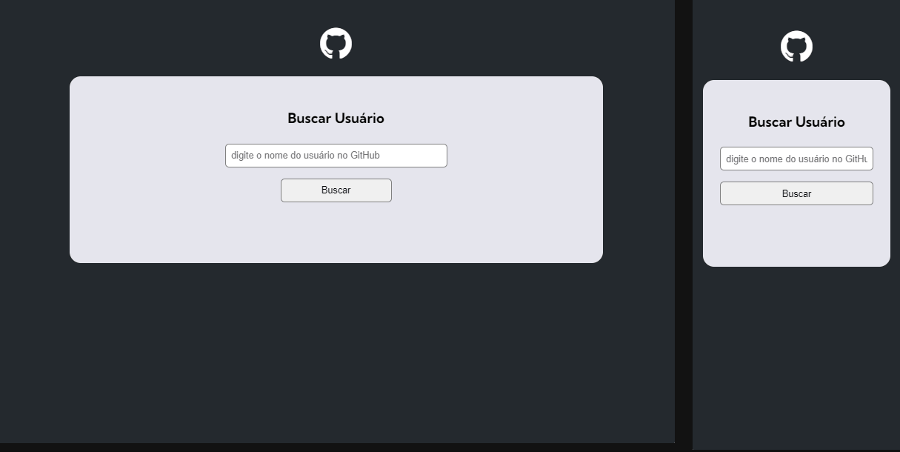

# GitHub API Search


Esse projeto foi um desafio proposto no módulo de JavaScript Avançado do curso *DevQuest* - Dev Em Dobro. O desafio tinha o intuito de pôr em prática os ensinamentos passados no módulo citado, sobretudo em relação ao consumo de *API* - não que isso já não estivesse sendo feito, mas desta vez com o formato de uma avaliação -, utilizando-se de um projeto iniciado em aula que consumia a *API* do *GitHub*. 

## Linguagens utilizadas
- *HTML*
- *CSS*
- *JS*

## Estrutura do desafio
O desafio foi dividido em três partes (chamadas "Solicitações"):
1.  Apresentar, na tela principal, o número de seguidores e pessoas seguindo, disponibilizados pela *API*;
2. Apresentar, também, até 10 eventos do usuário, primeiro buscando os dois tipos de evento exigidos (*Create* ou *Push*), depois mostrando na tela o nome do repositório e a mensagem do evento (*commit*), se houver;
3. Apresentar a quantidade de *forks*, estrelas, *watchers*, como também a linguagem  do repositório.

Também é exigido uma mensagem alternativa para a solicitação 2, no caso de inexistência de uma mensagem de evento, e para a apresentação da linguagem, especificamente, na solicitação 3.

## Desafios e dificuldades
Foi a primeira vez trabalhando com consumo de *API*, então naturalmente encontrei diversas dificuldades, principalmente na resolução da solicitação 2.

Isso me possibilitou aumentar as pesquisas com relação ao consumo e como trabalhar com *API*, além de aprofundar na linguagem *JS*, sobretudo com relação ao uso dos apóstrofos, das interpolações de *strings* e das inserções de conteúdo no *HTML*.

## Pós correção 

Acredito que seja importânte ressaltar de forma justa o aprendizado adquirido após as correções do desafio, como o uso do operador "?." ao lado do *commit*, que realiza uma leitura prévia da cadeia antes da sua validação - muito útil para eventos do tipo *Create*, pois antecipa o erro de validação nesse caso, resultando em *null* ou *undefined* e passando para a resposta alternativa.
```
${event.payload.commits?.[0].message ?? `Create ${event.payload.ref_type}`}
```

As dicas de refatoração - principalmente a de separar, dos comandos de renderização para usuário (*renderUser*), os comandos para os respositórios (*renderRepositories*) e para os eventos (*renderEvents*) - ajudaram bastante na simplificação e completude do código, pois havia lacunas nas respostas alternativas, como no caso *if/else* no *renderEvents* (não havia o *else*).